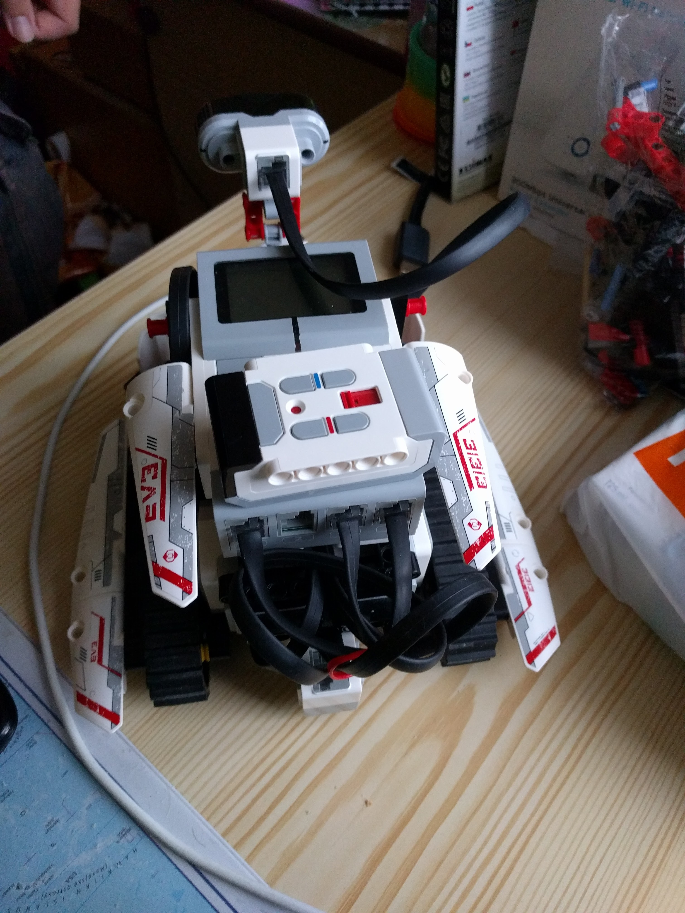

# EV3 Projects (lejos edition)

I've found this gem when searching my old projects. This project implements few "modes" for a Lego Mindstorms EV3 robot and was developed using the Lejos library.

The robot used for all of these modes had tank-like drive system, with two large motors for driving and one medium motor for rotating infrared sensor. This way it is possible to scan the robot surroundings and see how far are the obstacles around the robot. The robot looked like this:

**Mapper Mode** is supposed to implement SLAM (Simultaneous Localization and Mapping) algorithm, but it isn't fully implemented. Current implementation only scans surroundings, recalculates position (using lejos library) and applies updated position to the map. Then robot moves a bit and repeats.

**GraphicsScan Mode** is a simple mode that scans the surroundings and displays the data on the EV3 screen graphically. It is good for debugging what surfaces are properly detected by the infrared sensor.

**Drive Mode** in this mode the robot drives around automatically. It uses the infrared sensor to scan several directions and based on the data it changes speed of right and left motor trying to drive away from obstacles. If obstacle in front of the robot is getting closer, the robot will slow down and increase the rotation speed - this will make the regulation of heading unstable and the robot will eventually turn away from the obstacle. Needs some tuning to work properly with different robot configurations.

**BeaconFollow Mode** tries to replicate the beacon following program from the Lego Mindstorms examples, but improved - since the infrared scanner can rotate. The robot is supposed to follow the beacon (IR signal) emitted by the remote control. The robot will rotate the infrared sensor left and right and try to find the beacon. When the beacon is found, the robot will set the speed of the left and right motor based on the angle between the robot and the beacon to steer the robot towards the beacon.

## Usage

To run the project, you need to have the Lejos firmware installed on your EV3 brick. You can find the instructions on how to do it [here](https://sourceforge.net/p/lejos/wiki/Home/).

As for building the actual project, its been a long time since I created this, so it may not be as straightforward as I'd like it to be. But I'll try to write down the steps I remember:

- Clone the repository
- Install Java 7 JDK
- Run the project according to steps in lejos documentation
